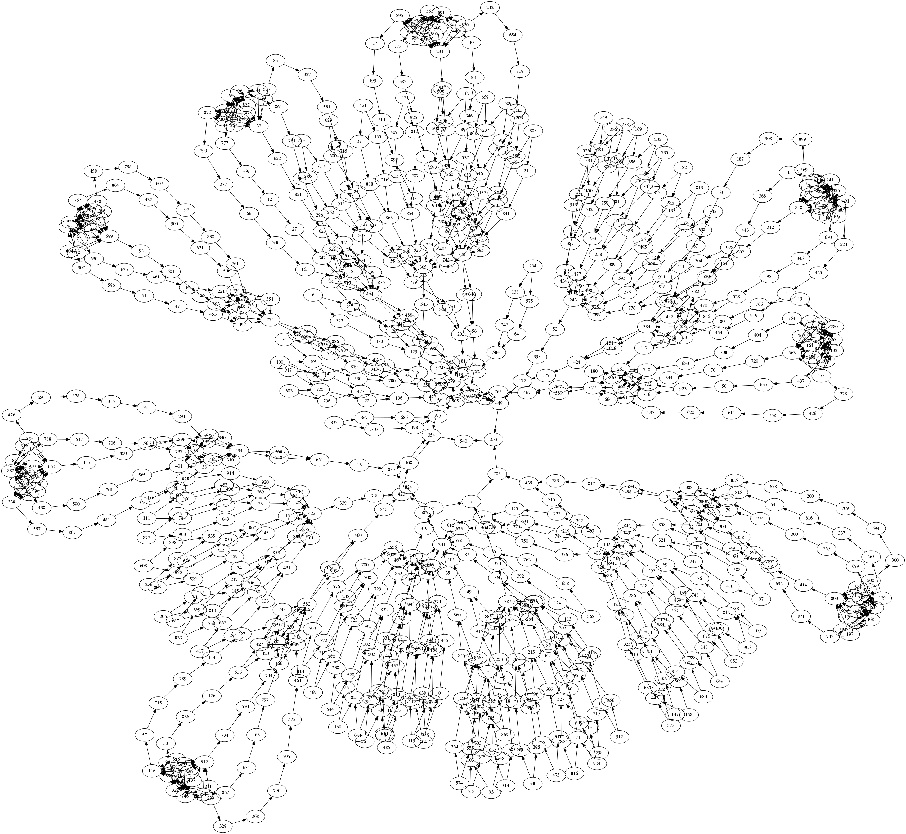

# Hierarchical Graph Visualizer

Analyze Re customers model their business inside of the Analyze Re platform in
form of graphs. Depending on the complexity of their business, these graphs can
get quite large and are difficult to visualize without overwhelming the user
with information. The goal of this challenge is to explore ways to provide a
hierarchical visualization of large graphs, which allow users to focus on
certain areas of the graph, while summarizing other areas. The application should be provided as a Web-based UI.

## Objectives

- Conceptualize and prototype a Web-based UI that allows navigation of a large graph similar to Google Maps
- Allow for details of the graph to be summarized in a "zoomed-out" view and reveal increasingly more detail as the user "zoomes in" to specific areas of the graph
- Allow the user to explicitly "collapse" regions of the graph that are not the focus of thier attention

## Example Data

[Download](hackathon-stripped.dot) as a [Graphviz](https://www.graphviz.org/) DOT file.

## Useful Links

- [Graph Amalgamation](https://en.wikipedia.org/wiki/Graph_amalgamation)
- [NetworkX](https://networkx.github.io/) - Python Graph Algorithms library
- [Graphviz](https://www.graphviz.org/) - Graph Visualization
- [Alchemy.js](http://graphalchemist.github.io/Alchemy/#/) - Graph Visualization in JavaScript
- [Cytoscape](http://js.cytoscape.org/) - Another Graph Visualization in JavaScript
- [D3.js](https://d3js.org/) - Data-Driven Documents
- [JointJS](https://www.jointjs.com/) - JavaScript library for flowchart and graph visualization
